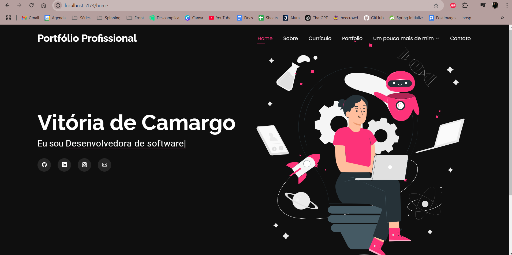

<h1>Portfólio2.0</h1>

<h2> EM ANDAMENTO<h2>

<h3>Criado com react + vite em TS.</h3>

<h4>Bibliotecas utilizadas até o momento:</h4>

* aos:2.3.4,
* bootstrap:5.3.3,
* bootstrap-icons:1.11.3,
* react:18.3.1,
* react-dom:18.3.1,
* react-router-dom:7.1.1,
* typed.js:2.1.0
* @eslint/js:9.17.0,
* @types/react:18.3.18,
* @types/react-dom:18.3.5,
* @types/react-router-dom:5.3.3,
* @vitejs/plugin-react:4.3.4,
* eslint:9.17.0,
* eslint-plugin-react-hooks:5.0.0,
* eslint-plugin-react-refresh:0.4.16,
* globals:15.14.0,
* typescript:5.6.2,
* typescript-eslint:8.18.2,
* vite:6.0.5